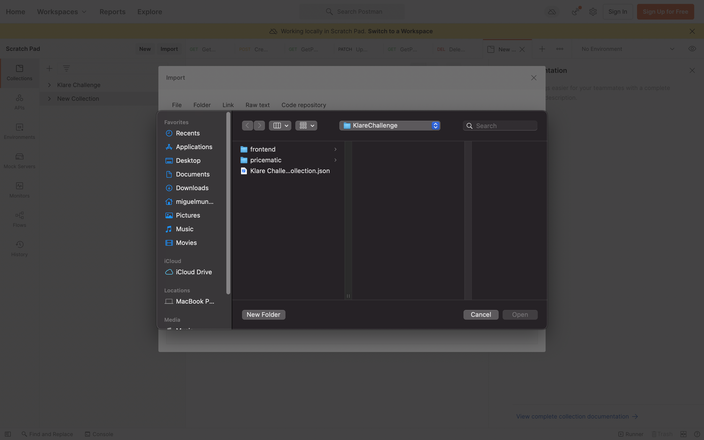
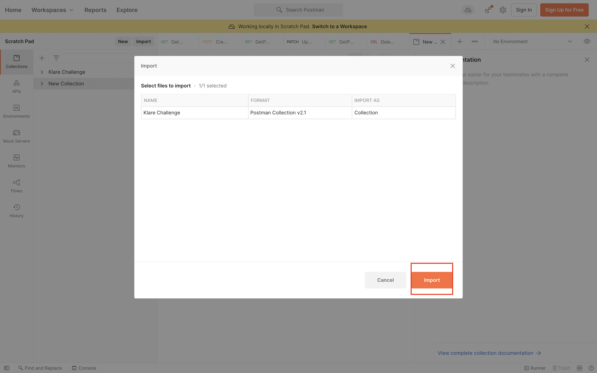
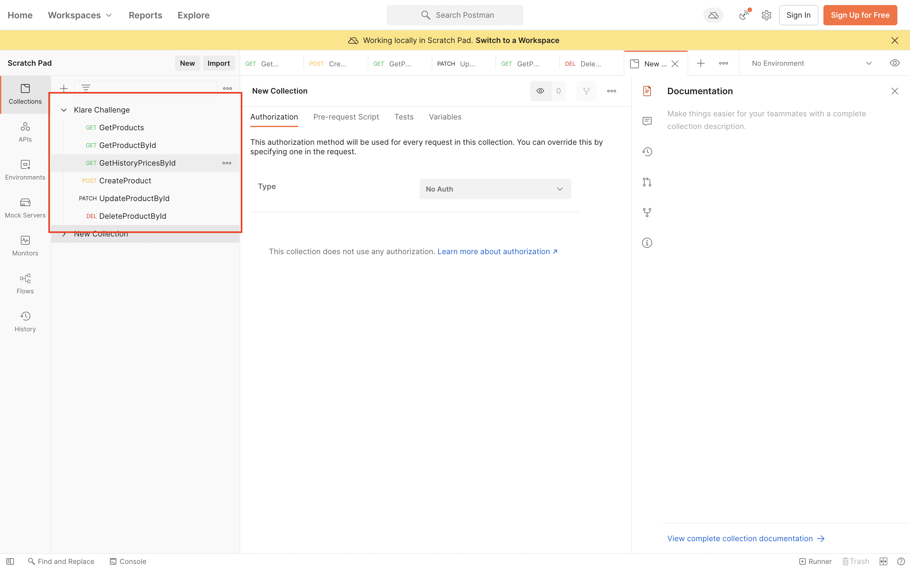

# Price o' Matic

**Desafío:** Crear un microservicio utilizando Go que se dedique a listar los precios de los productos.

## Incluido dentro de la solución

* Aplicación realizada en Go.
* Dockerfile
    * Se modifica para reducir tamaño.
    * Se agrega `.dockerignore` para no cargar archivos innecesarios.
* Se crean dos tablas para el manejo de la data `Product` y `Price`.
* Se utiliza tabla `Price` como historial de precios de los productos.
* Como motor de base de datos se utiliza imagen de postgres latest.
* Se utiliza GORM como ORM con plugin de postgres
* Archivo `local.env` con variables de entonro para que el contenedor pueda ser ejecutado correctamente.
* La solución esta expuesta en el puerto 8080 para poder ser consultada.

## Ejecución de la solución

Para poder utilizar la solución es necesario tener instalado docker de manera local realizando los pasos siguientes:

```
docker compose build

docker compose up -d
```

## Verificación de la solución

Se agregaron 3 tipos de validadores y son los siguientes:
* Swagger
* Colección de POSTMAN
* Página Web

Para acceder a **Swagger** es necesario ingresar a la url [Swagger](http://localhost:8080/swagger/). 

Es necesario ejecutar el siguiente comando en el directorio donde se ubique `main.go` para volver a generar la documentación.

```
./swag init --parseDependency --parseInternal
```


Para revisar la colección de POSTMAN es necesario importarla 





Para acceder a la pagina web esta se accede desde la siguiente url: [Url](http://localhost:8080)

## TODO o cosas por mejorar

* Implementar DTOs tanto de input como de output de los handlers ya que actualmente estan trabajando directamente con el modelo de DB.
* Trabajar con una db alojada en cloud o utilizar volumenes para el manejo persistente de los datos.
* Mejorar metodo PATCH para que trabaje con reflection y no sea solo un IF.
* Agregar seguridad a los metodos ya sea utilizando JWT propio o utilizando Amazon cognito, Azure AD, etc.
* Implementar una Web mejor
    * Al estar desplegado el historial el componente no recarga correctamente, es necesario cerrar y volver a abrir.
    * Falta un notificador tipo toast o modal que indique las acciones (Crear, Actualizar y Borrar)